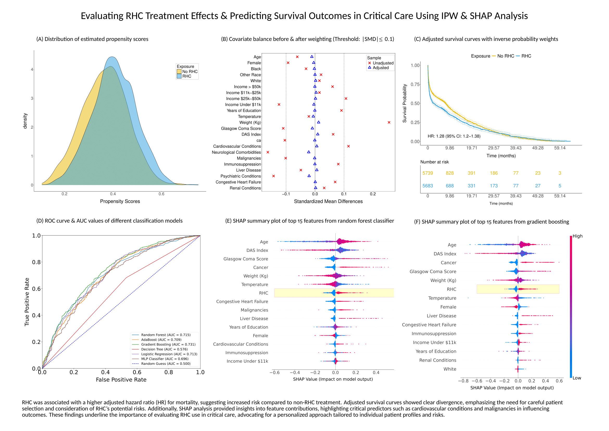

## RHC Treatment Effects & Survival Outcome Prediction



This repo contains tools and scripts for evaluating the effects of Right 
Heart Catheterization (RHC) on survival outcomes in critically ill patients. 
The project is built using R, Python, Docker, and a Makefile to ensure smooth data 
preprocessing and analysis. The instructions below will guide you through 
setting up the Docker container, installing necessary packages, and running 
the Makefile to reproduce the results. If you choose not to use the containerized 
approach, you can consult the provided `Dockerfile` to understand the necessary 
dependencies and setup requirements for running the code directly on your system. 
The `Dockerfile` outlines the environment configuration, including software 
installations, libraries, and other prerequisites, ensuring the code runs as 
intended. This can serve as a guide for setting up a compatible local environment.

⚠️ This project was developed and tested on Apple **M3 Pro**, ensuring 
compatibility and optimization for macOS systems. It should work on other 
platforms with the necessary dependencies installed.

### Prerequisites

Before you begin, ensure you have the following installed on your system:

- [Docker](https://docs.docker.com/get-docker/) is required to build and run 
the containerized environment.
- [Git](https://git-scm.com/) is used for version control and managing project 
repositories.
- [Make](https://www.gnu.org/software/make/) is a build automation tool used to 
control the generation of executables and other non-source files.


### Usage

To build the Docker container, you need to create a `.password` file containing 
the password you'd like to assign to the `rstudio` user in the container. Once 
you are done, run the following command to build the Docker container. On a 
**Mac M3 Pro** (or other ARM-based systems), ensure the container is built 
for the correct platform by specifying the target architecture:

```bash
docker build --platform linux/amd64 . --build-arg linux_user_pwd="$(cat .password)" -t eshun
```

Once the image is built, you can start an RStudio Server using the command 
below (for Unix-like systems)

```
docker run --platform linux/amd64\
           -d -p 8787:8787\
           -p 8888:8888\
           -e PASSWORD="$(cat .password)"\
           -v $(pwd):/home/rstudio eshun
```

To access the RStudio Server, open your web browser and navigate to: 
``http://localhost:8787``. Use ``rstudio`` as the username and the password 
you set in the ``.password`` file to log in after opening the Rstudio port. 
Port ``8888`` is also exposed to allow the use of a Jupyter server within the 
container (you don't need any authentication for the Jupyter server). This 
provides flexibility for running Jupyter Notebooks alongside RStudio, enabling 
a seamless development experience for both R and Python users.


### Outputs

This project generates two main PDF documents to summarize and report on the analysis performed:

1. ``Summary.pdf``: A concise overview of the project with visualizations, highlighting key findings. To generate, run:  
   
```bash
   make Summary.pdf
```

2. ``Report.pdf``: The final report containing all figures, analysis, and 
explanations of methodologies used in the project. This document is suited for 
readers or those seeking to replicate or expand upon the analysis.

```bash
   make Report.pdf
```